# Certification & Production

> [!CAUTION]
>
> For Certification and Production, you **require a real certificate**, [which can be bought separately](https://www.sii.cl/servicios_online/1039-certificado_digital-1182.html). Do not proceed until it's made available to the library.

To operate with the SII, the _Certification Process_ is mandatory. SII will _test_ your application if it complies with the basic and legal procedures to manage DTE. Luckily for you, this library makes this process simple.

## Flow

The certification process in SII is a multistep flow. SII requires your app to understand it can build DTE canonically and signed correctly, but also receive from other businesses and send them both to SII and businesses.

```mermaid
flowchart LR
    subgraph Pre-Certificación
        A["Contribuyente cumple con los requisitos y comienza proceso"] --> B["Obtiene certificado digital"]
        B --> C["Contribuyente adquiere o desarrolla software para facturar."]
        C --> D["Contribuyente postula al sistema en www.sii.cl"]
        D --> E["SII valida Información registrada e inscribe al contribuyente en ambiente de certificación"]
        E --> F["Contribuyente aceptado descarga set de pruebas*"]
    end

    subgraph AMBIENTE DE CERTIFICACIÓN
        subgraph Fase1 ["1. SET DE PRUEBAS"]
            G1["Contribuyente emite DTE de Prueba"] --> G2["Contribuyente envía Set DTE a www.sii.cl"]
            G2 --> G3["El SII revisa el Set de Pruebas enviado"]
            G3 --> G4["Si los DTE de Prueba se encuentran sin rechazos ni reparos, el contribuyente avanza al paso siguiente"]
        end

        subgraph Fase2 ["2. SET DE SIMULACIÓN"]
            H1["Contribuyente emite DTE con datos representativos de la operación real"] --> H2["Contribuyente envía Set DTE a www.sii.cl"]
            H2 --> H3["SII revisa el Set de pruebas enviado"]
            H3 --> H4["Si los DTE generados se encuentran sin rechazos ni reparos, el contribuyente avanza al paso siguiente"]
        end

        subgraph Fase3 ["3. INTERCAMBIO DE INFORMACIÓN"]
            I1["SII envía DTE al contribuyente postulante"] --> I2["SII comprueba que el contribuyente entregue un acuse de recibo y la aceptación o rechazo de los documentos enviados"]
            I2 --> I3["Si el intercambio de información es correcto, el contribuyente avanza al paso siguiente"]
        end

        subgraph Fase4 ["4. DOCUMENTOS IMPRESOS"]
            J1["Contribuyente envía por e-mail al SII, representación gráfica de DTE"] --> J2["SII revisa representación gráfica"]
            J2 --> J3["Si los DTE impresos se encuentran conformes a la normativa e incluyen el timbre electrónico, el contribuyente avanza al paso siguiente"]
        end
    end

    subgraph Autorización
        K["Contribuyente declara en www.sii.cl cumplir con los requisitos para emitir y recibir Facturas Electrónicas"] --> L["SII registra como emisor de documentos tributarios electrónicos al contribuyente, de acuerdo a Resolución Exenta SII N°80 de 2014."]
    end

    %% Phase Transitions
    F --> G1
    G4 --> H1
    H4 --> I1
    I3 --> J1
    J3 --> K

    %% Footnote
    Note["* Set compuesto a lo menos del conjunto básico de Documentos Tributarios Electrónicos (DTE): factura electrónica, nota de crédito electrónica y nota de débito electrónica."]
    F -.-> Note
```



## Prerequisites

**1. Digital certificate.** You must [acquire a P12/PFX certificate](https://www.sii.cl/servicios_online/1039-certificado_digital-1182.html) from the SII and make it available to the library, along with its password. Use any flow to store the certificate and password in your app, like storing it both in the database.

Use the `resolveUsing()` to manually return an instance of `DigitalCertificate` with the certificate string and the certificate password, if you haven't already.

```php
use App\Models\Company;
use Illuminate\Contracts\Config\Repository;
use Illuminate\Contracts\Filesystem\Factory;
use Laragear\Dte\Certificate\CertificateResolver;
use Laragear\Dte\Certificate\DigitalCertificate;

CertificateResolver::resolveUsing(function (): ?DigitalCertificate {
    $company = Company::first();
    
    if ($company) {
        return null;
    }
    
    return new DigitalCertificate($company->cert, $company->cert_pass);
});
```

**2. Company configuration.** Register your company's issuer data:

```php
use Laragear\Dte\Configuration\ConfigurationManager;
use Laragear\Dte\Data\IssuerData;
use Laragear\Rut\Rut;

public function register()
{
    ConfigurationManager::resolveIssuerUsing(function (?Rut $rut): IssuerData {
        return new IssuerData(
            rut: Rut::parse('76.123.456-0'),
            legalName: 'Tu empresa SpA',
            businessActivity: '620100',
            economicActivity: ['620100'],
            address: 'Calle Falsa 123',
            commune: 'SANTIAGO',
            resolutionDate: '2026-01-01',
            resolutionNumber: 0, 
        );
    });
}
```

> [!NOTE]
>
> Use your **certification** resolution date and number. These are published on the SII certification portal under your company's test data. You need this beforehand starting certification.

If the sender of the documents (`RutEnvia`) differs from the issuer of the documents, which is a rarity for certification, register it separately.

```php
use Laragear\Dte\Configuration\ConfigurationManager;
use Laragear\Dte\Data\IssuerData;
use Laragear\Rut\Rut;

public function register()
{
    // ...
    
    ConfigurationManager::resolveSenderUsing(fn() => Rut::parse('76.123.456-0'));
}
```

**3. Switch to the certification environment:**

You should do this dynamically in your application, but as an alternative, you may change the environment variable.

```dotenv
DTE_ENV=certification
```

## Phases

The SII certification process has six phases. Each phase has specific requirements that you (the developer) must fulfill **before** the library can work on production.

### Phase 1 — Set de Pruebas (Test Set)

The SII provides a **test set** — a list of document specifications your application must create and submit. These are **not** documents you receive from SII; they are instructions to build DTEs from scratch using the exact data provided.

A typical test set looks like this:

```
FACTURA ELECTRONICA 			 32
FACTURA DEL GIRO CON DERECHO A CREDITO
  10221		  10335

NOTA DE CREDITO				451
NOTA DE CREDITO POR DESCUENTO A FACTURA 234
		   2880
```

Each entry specifies: document type, folio number, description, amounts, and sometimes references to other documents in the set.

#### Step 1a — Create DTEs from test set instructions

For each entry in the test set, create a DTE in your database. The **receiver RUT** should be a valid customer RUT; use different RUTs for different invoices (do not repeat them), as the SII instructs, so you'll need to find real businesses with their apropiate data. 

Use `forTestCase()` to mark a DTE as part of a test set case. This adds the required SET/CASO reference line automatically:

```php
use App\Models\Business;
use Laragear\Dte\Facades\SiiInvoice;
use Laragear\Dte\Facades\SiiCreditNote;

// Create an invoice for the test set
$dte = SiiInvoice::issuedBy('76.123.456-0')     // your company RUT
    ->receivedBy(Business::find(1))             // a customer RUT (distinct per invoice)
    ->addItem(item: 'Cajón AFECTO', unitPrice: 1599, quantity: 135)
    ->forTestCase('5034081-1')                  // marks as CASO 5034081-1
    ->create();

// Credit note referencing an original invoice
$dte = SiiCreditNote::issuedBy('76.123.456-0')
    ->receivedBy(Business::find(2))
    ->forTestCase('5034081-5')
    ->annul(SiiDte::find(1), reason: 'CORRIGE GIRO DEL RECEPTOR')
    ->create();
```

The `forTestCase()` prepends a reference line with `TpoDocRef="SET"` and `RazonRef="CASO xxxxx-x"` on every `references()` call — this survives correction methods like `annul()` that replace the reference list.

> [!IMPORTANT]
>
> **Reference line required.** The first reference of every test set DTE must have:
> - `TpoDocRef` = `"SET"` (handled by `forTestCase()`)
> - `RazonRef` = `"CASO xxxxx-x"` (handled by `forTestCase()`)
>
> Credit notes referencing original invoices add the invoice reference on line 2 (via `annul()` or `addReference()`).

#### Step 1b — Upload the Test Set as an EnvioDTE envelope

After creating all DTEs, send them as a batch envelope. The library validates SET/CASO references, sorts documents in case order, and uploads via the SII certification endpoint:

```php
$testData = $manager->testSet('76.123.456-0', [1, 2, 3, 4, 5, 6, 7]);

$trackId = $testData->envelope->trackId;  // Track ID to poll for status
$status = $testData->envelope->status;   // Current envelope status
```

The manager automatically:

1. Retrieves the DTEs by ID (filtering to `pending`, `signed`, `sent`, or `accepted` status).
2. **Validates** each DTE has the SET/CASO reference on line 1, or throws with guidance.
3. **Sorts** documents by case number from the `CASO xxxxx-x` reason.
4. Compiles any unsigned DTEs.
5. Creates an envelope with `RutReceptor = 60803000-K` (SII), mixed document types, and one `SubTotDTE` per type with per-type counts.
6. Signs each DTE (RSA-SHA1, C14N), signs the `SetDTE`, uploads to `https://maullin.sii.cl/cgi_dte/UPL/DTEUpload`, and returns the **TrackID**.

Alternatively, pass a pre-built collection or array directly if you need to build each DTE separately.

```php
use Laragear\Dte\Facades\SiiCreditNote;use Laragear\Dte\Facades\SiiInvoice;

$dtes = [
    // ...
]

$testData = $manager->testSetUsing('76.123.456-0', $dtes);
```

Poll the result using the `dte:poll-track-status` Artisan Command, or programmatically:

```php
use Laragear\Dte\Jobs\PollEnvelopeTrackIdJob;

PollEnvelopeTrackIdJob::dispatchSync($testData->envelope);
```

Otherwise, you may want to schedule it for each minute to check 

#### Sub-step 1c — Build and upload the IECV (Sales Book)

The Sales Book (`Libro de Ventas` / IEV) lists every sales document the company issued during the test period. Only **reported** documents (those sent in an envelope and with `sent`/`accepted` status) are included. The book automatically filters to Facturas (33/34), Notas de Débito (56), and Notas de Crédito (61).

```php
$salesBook = $manager->salesBookTestSet('76.123.456-0', [1, 2, 3]);

return $salesBook->iecvTrackId;
```

The manager automatically:

1. Retrieves only DTEs that have been sent in an envelope (envelope-associated, status `sent` or `accepted`).
2. Filters to sales-relevant types: Invoice (33), InvoiceExempt (34), DebitNote (56), CreditNote (61).
3. Resolves your **resolution date/number** and **sender RUT** from the `ConfigurationManager`.
4. Validates all documents share the same **tax period** (`YYYY-MM`).
5. Builds a `LibroCompraVenta` XML with `TipoOperacion=VENTA`, `TipoLibro=ESPECIAL`, `TipoEnvio=TOTAL`, `FolioNotificacion=1`.
6. Aggregates totals by document type in `ResumenPeriodo`.
7. Writes one `Detalle` entry per DTE (with `RUTDoc` = the **receiver** RUT, i.e. your customer).
8. Validates the XML against `LibroCV_v10.xsd`, signs (RSA-SHA1, C14N), and uploads via HTTP multipart to SII.

#### Sub-step 1d — Build and upload the IECV (Purchases Book)

The Purchases Book (`Libro de Compras` / IECV) lists documents the business **received from suppliers**. Unlike the Sales Book, the Purchases Book does not use `SiiDte` records — it accepts the test set data directly as entries, because the purchase documents are third-party data, not documents your application issued.

Build an array of `IecvPurchaseData` entries from the SII's purchases test set and pass them to `purchasesBookTestSet()`:

```php
use Laragear\Dte\Certification\IecvPurchaseData;
use Laragear\Dte\Certification\IecvProperty;
use Laragear\Dte\Enums\DteType;

$entries = [
    IecvPurchaseData::make(
        documentType: DteType::InvoicePhysical, // 30
        folio: 234,
        issuedOn: '2026-09-01',
        issuerRut: '99.888.777-1',              // supplier RUT from the set
        amountNet: 45899,
    ),
    IecvPurchaseData::make(
        documentType: DteType::Invoice,         // 33
        folio: 781,
        issuedOn: '2026-09-01',
        issuerRut: '99.888.777-1',
        amountNet: 30082,
        ivaCommonUse: true,                     // IVA uso común
    ),
    IecvPurchaseData::make(
        documentType: DteType::CreditNote,      // 61
        folio: 451,
        issuedOn: '2026-09-01',
        issuerRut: '99.888.777-1',
        amountNet: 2880,
        referenceType: DteType::InvoicePhysical, // references factura 234
        referenceFolio: 234,
    ),
];

// Pass the IVA proporcionalidad factor for uso común (set by SII)
$properties = [IecvProperty::CommonIvaFactor->of(0.60)];

$purchasesBook = $manager->purchasesBookTestSet(
    '76.123.456-0',
    $entries,
    $properties,
);

return $purchasesBook->iecvTrackId;
```

The `IecvPurchaseData` entry fields map to the IECV XML:

| Entry field        | IECV XML element | Notes                                          |
|--------------------|------------------|------------------------------------------------|
| `documentType`     | `TpoDoc`         | `DteType` enum or raw int (30, 33, 46, 61...)  |
| `folio`            | `NroDoc`         | Folio from the test set                        |
| `issuedOn`         | `FchDoc`         | `Y-m-d` format                                 |
| `issuerRut`        | `RUTDoc`         | The supplier's RUT                             |
| `amountNet`        | `MntNeto`        | "Monto Afecto" from the set                    |
| `amountExempt`     | `MntExe`         | "Monto Exento" from the set                    |
| `ivaCommonUse`     | `IVAUsoComun`    | `TotOpIVAUsoComun`/`TotIVAUsoComun` in resumen |
| `noCost`           | `IndSinCosto=1`  | Entrega gratuita del proveedor                 |
| `ivaRetainedTotal` | `IVARetTotal`    | Compra con retención total del IVA             |
| `referenceType`    | `TpoDocRef`      | For NC/ND referencing another document         |
| `referenceFolio`   | `FolioRef`       | Folio of the referenced document               |

The manager automatically:

1. Validates all entries share the same tax period.
2. Resolves **resolution date/number** and **sender RUT**.
3. Computes `MntIVA`, `MntTotal`, and `TotCredIVAUsoComun` from net amounts and IVA rate.
4. Builds `LibroCompraVenta` XML with `TipoOperacion=COMPRA`, `FolioNotificacion=2`.
5. Validates against `LibroCV_v10.xsd`, signs, and uploads to SII.

> [!IMPORTANT]
>
> **IVA proporcionalidad.** For entries with `ivaCommonUse: true`, pass `IecvProperty::CommonIvaFactor->of(0.60)` (or the factor value SII specifies for your company). This populates `FctProp` and `TotCredIVAUsoComun` in the resumen.

---

### Phase 2 — Simulación (Simulation)

The manager generates a random batch of DTEs (default 10) using Faker and uploads them as an EnvioDTE envelope:

```php
use Laragear\Dte\Certification\CertificationManager;

public function simulation(CertificationManager $manager)
{
    $simulationData = $manager->simulate('76.123.456-0', 10);
    
    // ...
}

public function simulationStatus()
{
    // Poll the status:
    dispatch(new PollEnvelopeTrackIdJob($simulationData->envelope));
    
    // ...
}
```

You can customize the generated document types and quantities:

```php
use Laragear\Dte\Enums\DteType;

$types = [
    DteType::Invoice->value,
    DteType::InvoiceExempt->value,
    DteType::CreditNote->value,
    DteType::DebitNote->value,
];

$manager->simulate('76.123.456-0', 50, $types);
```

No DTEs need to be pre-created — the manager generates everything from scratch based on your issuer configuration and available CAFs.

#### Using pre-built DTEs for simulation

For more control, build DTEs with `DocumentBuilder` and pass them to `simulateUsing()`:

```php
use Laragear\Dte\Facades\SiiInvoice;
use Illuminate\Database\Eloquent\Collection;

$dte1 = SiiInvoice::issuedBy('76.123.456-0')
    ->receivedBy('60.803.000-K')
    ->addItem(item: 'Product A', unitPrice: 5000, quantity: 2)
    ->create();

$dte2 = SiiInvoice::issuedBy('76.123.456-0')
    ->receivedBy('60.803.000-K')
    ->addItem(item: 'Service B', unitPrice: 25000, quantity: 1)
    ->create();

$dtes = new Collection([$dte1, $dte2]);

$simulationData = $manager->simulateUsing('76.123.456-0', $dtes);
```

This bypasses Faker generation, letting you use realistic data for the simulation.

---

### Phase 3 — Intercambio de Información (Interchange)

The SII sends DTEs to your DIM (electronic inbox). The manager fetches, validates, and responds:

```php
use Laragear\Dte\Certification\CertificationManager;

public function dim(CertificationManager $manager)
{
    // Option A: Upload a DTE XML file you downloaded from your mailbox
    $data = $manager->interchange(
        '76.123.456-0',
        source: 'file',
        filePath: '/path/to/interchange.xml',
        location: 'Santiago',
    );
    
    // Option B: Pass raw XML content directly
    $data = $manager->interchange(
        '76.123.456-0',
        source: 'content',
        xmlContent: $xmlString,
        location: 'Santiago',
    );
    
    // Option C: Let the library fetch from your configured DIM mailbox (default)
    $data = $manager->interchange('76.123.456-0', location: 'Santiago');
}
```

The manager:

1. Parses the inbound DTE XML (`FetchInterchangeXml`).
2. Creates an `SiiInboundDocument` record and stores the DTE (`ProcessInboundDte`).
3. Sends a commercial acknowledgment receipt (`EnvioRecibos`, per Ley 19.983-96) back to SII (`AcceptAndSendReceipt`).
4. Sends the DTE-level acceptance/rejection via the SII SOAP claim web service (`DteClaimService`).

> [!NOTE]
>
> Acceptance/rejection requires a configured **mailbox driver** (`dte.dim.mailer`) or a downloaded XML file.

---

### Phase 4 — Documentos Impresos (Print Samples)

The manager generates PDF representations of your DTEs, including the PDF417 barcode and _timbre electrónico_. Pass the DTE IDs to generate PDFs for specific documents:

```php
use Laragear\Dte\Certification\CertificationManager;

public function printable(CertificationManager $manager)
{
    // Generate PDFs for specific DTEs
    $printData = $manager->printSample('76.123.456-0', [1, 2, 3, 4, 5]);

    // Or generate PDFs for all DTEs (pass empty array)
    $printData = $manager->printSample('76.123.456-0');
}
```

The PDFs are stored on disk. If the SII requires a single concatenated PDF, you will need to merge them yourself using any free service, e.g.: [I Love PDF](https://www.ilovepdf.com/), [BentoPDF](https://www.bentopdf.com/), [EmbedPDF](https://www.embedpdf.com/tools/pdf-merge), [PrivatePDF Merge](https://privatepdfmerge.com/), [Pipefile](https://pipefile.com/tools/pdf-merger), [Toolflic](https://toolflic.com/tool/pdf-merge/), and many more.

---

### Phase 5 — Declaración de Cumplimiento

You digitally sign (via the SII web portal) your compliance to operate on production servers.

> [!CAUTION]
> 
> Once you sign, **you lose access to the free SII Web App to manage DTE**. Back up all your historical data before. If you consider this a drawback, desist and use this library as a way to manually mirror your data in SII.

---

### Phase 6 — Autorización

The SII validates your submission and issues an authorization resolution. You can now move to production.

```dotenv
DTE_ENV=production
```

If you have the prior DTE leftovers from certification, you should also truncate all tables to avoid mixing real data with dummies.

```php
use Laragear\Dte\Certification\CertificationManager;

public function clean(CertificationManager $manager)
{
    $manager->purgeDatabase();
}
```

---

Once your application is prepared to operate with real transactions, move the package to `production`:

```dotenv
DTE_ENV=production
```
